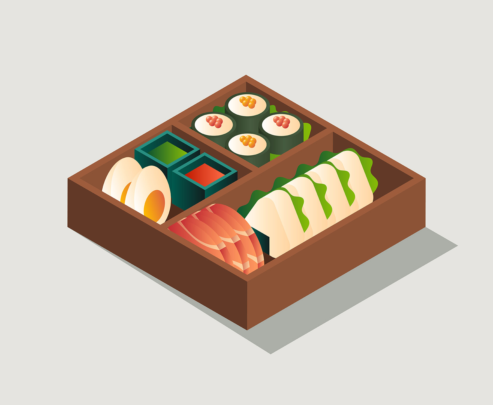

<h1 align="center">
  <br/>
  Sushi
</h1>
<p align="center">Sushi is the Marketing website for <a href="https://bento-bot.com/" target="_blank">Bento Bot</a> - The multifuctional, modular Discord bot.</p>
<p align="center">Sushi is a Next.JS application, built with TypeScript and ChakraUI, and boostrapped using create-next-app.</p>

# Running Sushi

## ⚡ Quick Start for Development

First, run the development server:

```bash
npm run dev
```

Open [http://localhost:3000](http://localhost:3000) with your browser to see the running development environment. The development environment will automatically refresh on changes.


## Deploying Sushi

Sushi is deployed using Cloudflare Pages, and is automatically deployed on push to the `main` branch. The `main` branch is protected, and requires review before merging.